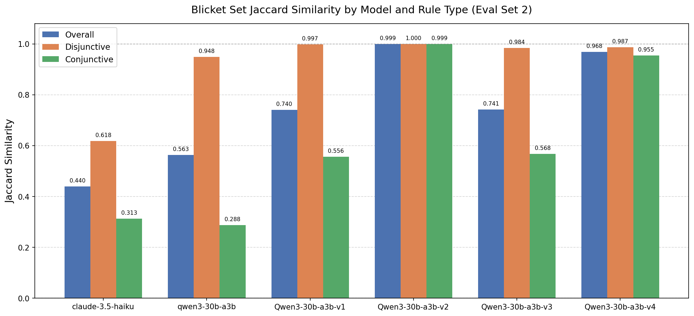
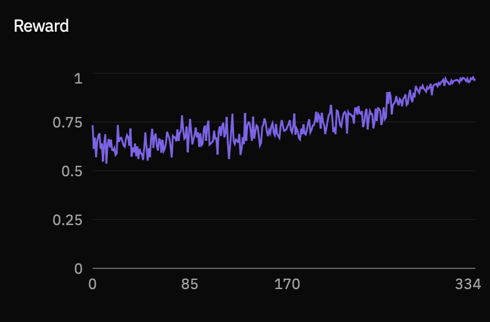
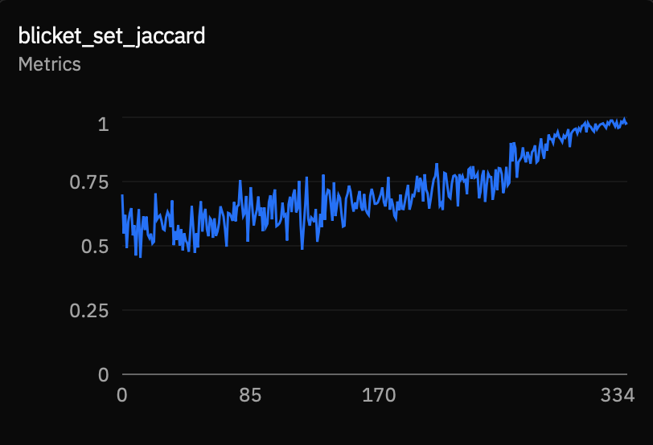
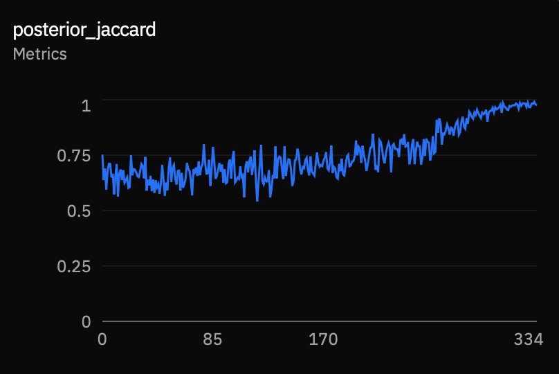
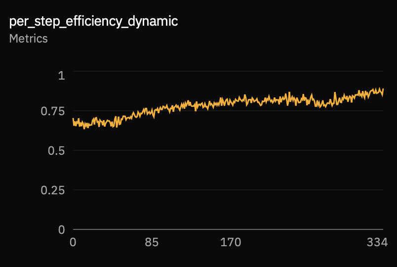
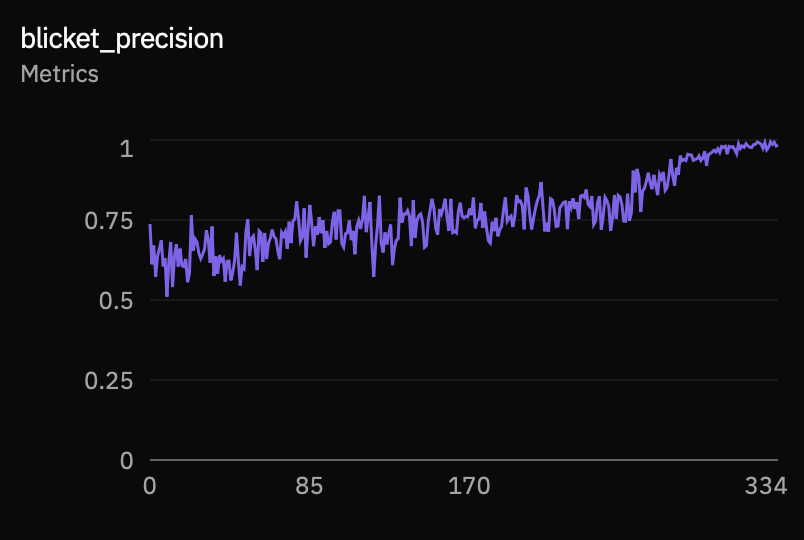
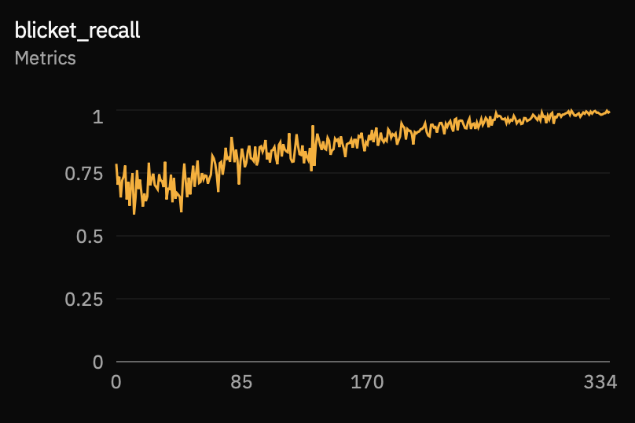

# BlicketTest_CausalReasoning

Multi-turn causal reasoning environment based on the Blicket detector paradigm from developmental psychology. Built with Prime Intellect's [verifiers](https://github.com/PrimeIntellect-ai/verifiers) framework.

## Setup

```bash
prime env install BlicketTest_CausalReasoning
```

## Usage

```bash
# Install locally
prime env install BlicketTest_CausalReasoning

# Run evaluation
prime eval run BlicketTest_CausalReasoning

# Push to Prime Hub
prime env push -p ./environments/BlicketTest_CausalReasoning
```

## Environment

| Environment | Description |
| ----------- | ----------- |
| [BlicketTest_CausalReasoning](environments/BlicketTest_CausalReasoning/) | Multi-turn environment where an agent must identify which objects are "Blickets" by designing experiments with a Blicket-detecting machine. Tests causal reasoning, hypothesis elimination, and experimental design. Inspired by [Do LLMs Think Like Scientists? Causal Reasoning and Hypothesis Testing in LLMs](https://arxiv.org/pdf/2505.09614) |

## Evaluation Results

Eval run on [`irfanjamil/BlicketEnv_Eval_Set`](https://huggingface.co/datasets/irfanjamil/BlicketEnv_Eval_Set) (60 examples: 35 conjunctive, 25 disjunctive; n ∈ [5, 13]).

**Blicket Set Jaccard** — Jaccard similarity between the predicted and gold Blicket sets, averaged across rollouts per example:



## Training Results

The plots below are from an RL training run of **Qwen3-30b-a3b-instruct-2507** using the reward function defined in **environment v0.1.4** (weights: `blicket_set_jaccard` 0.50, `posterior_jaccard` 0.35, `per_step_efficiency_dynamic` 0.10, `format_compliance` 0.05).

**Total reward:**



**Blicket set Jaccard similarity:**



**Posterior Jaccard** (hypothesis-space quality at end of exploration):



**Per-step information-seeking efficiency:**



**Blicket precision** (`TP / |predicted|`):



**Blicket recall** (`TP / |gold|`):


